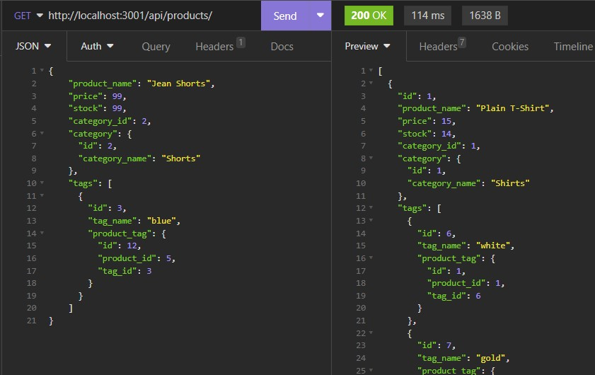
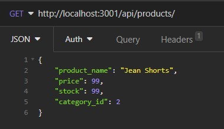
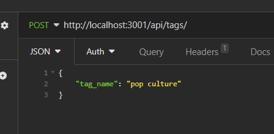
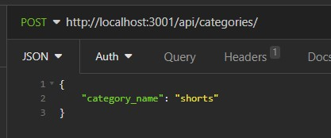

# E-Commerce Back End

## Description
This project provides the back end data management for an e-commerce company using JavaScript object oriented programming, and Express JS provides the routes for the GET/POST/DELETE requests. The project functionality can be easily navigated using Insomnia.

## Installation
This application can be tested and used following the below instructions: 
1. Clone the git repository to your local machine. 
2. Create a .env file in your local machine with your own MySQL authentication details
3. Install all dependencies by running the following command in the command line interface: npm i
4. Seed the data by running the following command in the command line: npm run seed
5. Start the application by connecting the server by running the following command: npm run start

## Usage
Open Insomnia to test the GET, POST, DELETE functions. Please run the GET requests to either the api/products/, api/products/:id, api/categories/, api/categories/:id, api/tags, api/tags/:id endpoints. 
Please use the POST functionality by ensuring the following structure for any post request to the api/products endpoint: 

Please use the POST functionality by ensuring the following structure for any post request to the api/tags endpoint: 

Please use the POST functionality by ensuring the following structure for any post request to the api/categories endpoint: 

Please use the DELETE functionality by specifying the id of the product/category/tag you would like to delete at the endpoint when placing a DELETE request. If correctly done, you will recieve a message confirming you have successfully deleted the product/tag/category with the respective id. 

## License
N/A

